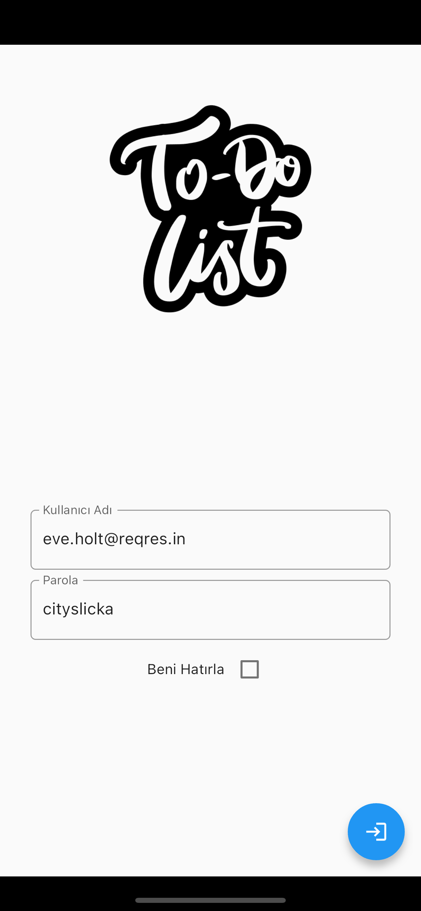
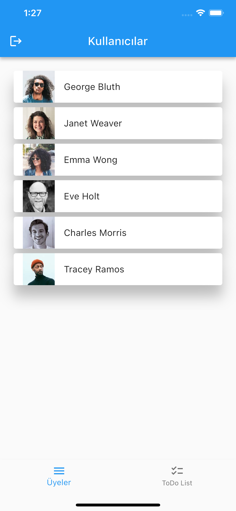
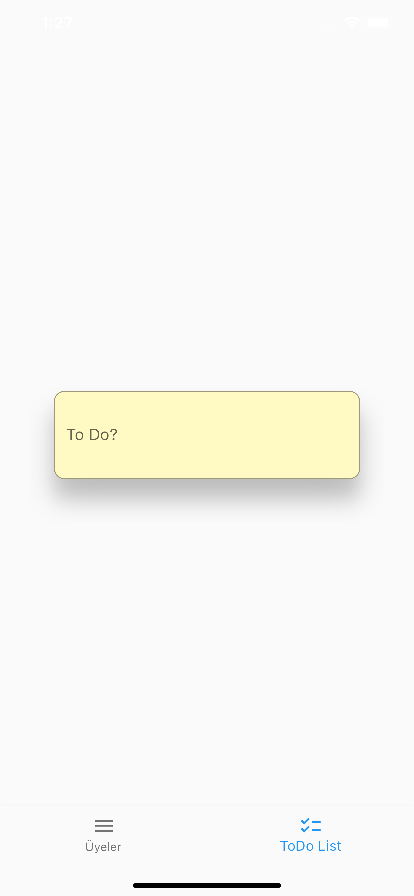
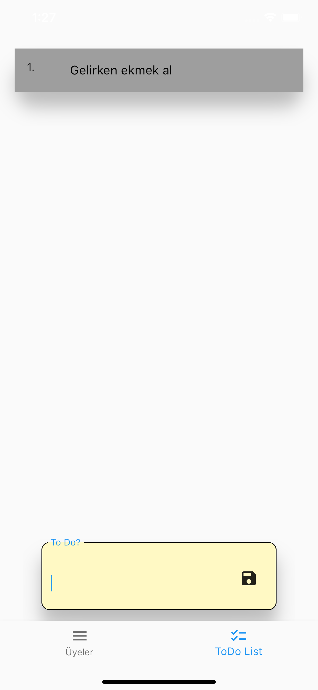
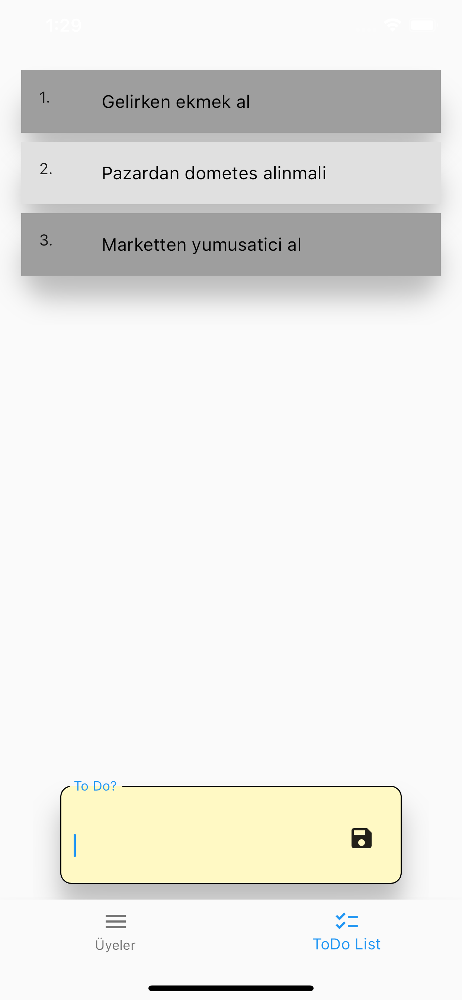
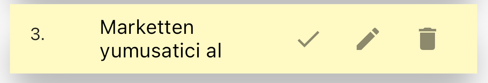
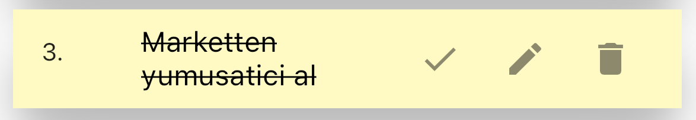
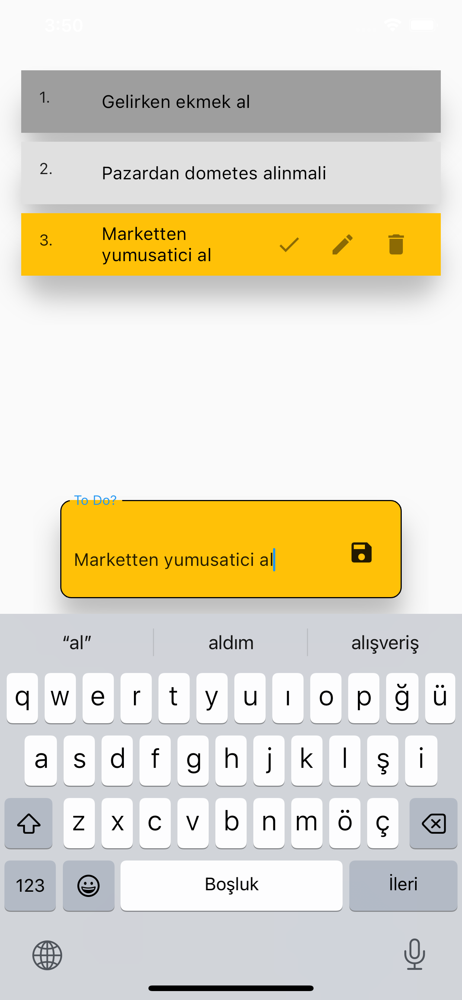

# ToDo List App

Bu uygulama basit bir ToDo List uygulamasıdır. İlk sayfasında reqres.in sitesinden dummy kullanıcı listesini çeker. İkinci sayfasında ToDo'ları kaydedebilirsiniz.

# İndirme Linki 

[todoList APK 1.0.0](https://github.com/ertadis/todolistApp/releases/tag/Release "download")

# Nasıl Kullanılır

Giriş sayfasında bir kullanıcı adı ve şifre alanı bulunmaktadır. 
Demo giriş amaçlı bilgileri hazır girilidir.

Giriş yaptığınızda sizi kullanıcı listesi karşılar. 
Bu sayfada reqres.in sitesinden çekilen dummy kullanıcı listesi vardır.

Alttaki Navigasyon butonlarından ToDoList sayfasına geçerseniz aşağıdaki sayfa sizi karşılar.
Bu sayfada ToDo'larınızı kaydedebilirsiniz. Uygulamayı kapatıp açmanız ToDo'larınızı silmez.

ToDo'ların üstüne tıklayıp tamamlandı olarak işaretleyebilir, değiştirebilir yada silebilirsiniz.

ToDo'ların üstüne tıklayınca çıkan kalem simgesine tıklayarak değiştirip kaydedebilirsiniz.

